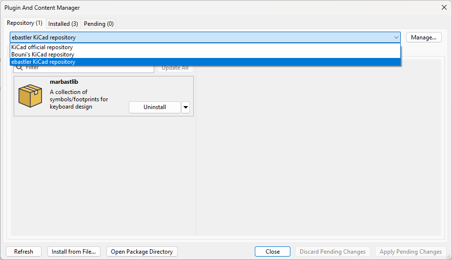

# marbastlib
A library collecting MX and Choc style footprints, as well as various other parts used to design custom keyboards. It is maintained by [ebastler](https://github.com/ebastler/) and [MarvFPV](https://github.com/marvfpv). The latest release is made in/for KiCAD 8.0 stable version. Older releases are still offered for KiCAD 7.0 stable versions by the PCM. Older versions are no longer supported by the main branch, please refer to one of the v6 branches for KiCAD 6.x, and my (significantly smaller) [legacy lib](https://github.com/ebastler/KiCAD-keyboard-parts.pretty) for KiCAD 5.x.

We try to offer 3D models for as many footprints in this library as possible, creating our own models where none exist. All components for which we have models available have them linked into the footprint - the PCM version will automatically download everything in the right file paths.

## How to install
Open the KiCAD "Plugin and Content Manager" (referred to as "PCM" from now on) and click on "Manage". Add a new entry with the plus sign and paste 

```
https://raw.githubusercontent.com/ebastler/ebastler-KiCAD-repository/main/repository.json
```

From this point on you will have "ebastler KiCAD repository" in your drop-down selection, and it will allow you to install (and update) marbastlib through PCM - easy and hassle-free.



### **We do not assume any responsibility for broken PCBs or damages derived from errors in this library. Use at your own risk, and please open an issue or pull-request if you encounter any errors.**


## Symbol Libs
### marbastlib-mx
* MX_SW_solder - switch symbol with pre-assigned 1u solder footprint
* MX_SW_HS_CPG151101S11 - switch symbol with pre-assigned 1u Kailh CPG151101S11 hotswap footprint
* MX_SW_HS_KS-2P02B01-01 - switch symbol with pre-assigned 1u Gateron KS-2P02B01-01 hotswap footprint
* MX_Stab - a symbol used to place keyboard stabilizers. Pre-assigned 6.25u stabilizer.
* MX_SK6812MINI-E - symbol with preassigned footprint for reverse mount addressable SK6812MINI-E RGB LEDs
* MX_LED_6028R - symbol with preassigned footprint for reverse mount [6028](https://www.alibaba.com/product-detail/high-brightness-reverse-mount-4-pin_60782094930.html) RGB LEDs
* MX_LED_MHT151RGBCT - symbol with preassigned footprint for [MHT151RGBCT](https://datasheet.lcsc.com/lcsc/2104121904_MEIHUA-MHT151RGBCT_C409782.pdf) LEDs

### marbastlib-choc
* choc_v1_SW_solder - switch symbol with pre-assigned 1u solder footprint
* choc_v1_SW_HS_CPG135001S30 - switch symbol with pre-assigned 1u Kailh CPG135001S30 hotswap footprint
* choc_Stab - a symbol used to place keyboard stabilizers. Pre-assigned 2u stabilizer.
* choc_SK6812MINI-E - symbol with preassigned footprint for reverse mount addressable SK6812MINI-E RGB LEDs
* choc_LED_6028R - symbol with preassigned footprint for reverse mount [6028](https://www.alibaba.com/product-detail/high-brightness-reverse-mount-4-pin_60782094930.html) RGB LEDs
* choc_LED_MHT151RGBCT - symbol with preassigned footprint for [MHT151RGBCT](https://datasheet.lcsc.com/lcsc/2104121904_MEIHUA-MHT151RGBCT_C409782.pdf) LEDs

### marbastlib-gatlp
* KS33_SW_solder - switch symbol with pre-assigned 1u solder footprint
* KS33_SW_HS_CPG135001S30 - switch symbol with pre-assigned 1u Gateron KS-2P02B01-02 hotswap footprint
* KS33_SK6812MINI-E - symbol with preassigned footprint for reverse mount addressable SK6812MINI-E RGB LEDs
* KS33_LED_6028R - symbol with preassigned footprint for reverse mount [6028](https://www.alibaba.com/product-detail/high-brightness-reverse-mount-4-pin_60782094930.html) RGB LEDs
* KS33_LED_MHT151RGBCT - symbol with preassigned footprint for [MHT151RGBCT](https://datasheet.lcsc.com/lcsc/2104121904_MEIHUA-MHT151RGBCT_C409782.pdf) LEDs

### marbastlib-various
* BAV70_Small - a smaller version of the regular BAV70 symbol (easier to use in keyboard matrices)
* DMP1022UFDF - very small p-ch FET, -9.5A, -12V [DMP1022UFDF](https://datasheet.lcsc.com/lcsc/1806082142_Diodes-Incorporated-DMP1022UFDF-7_C155358.pdf)
* DW01A - a cheap and easily available 1S battery protection chip
* FS8205 - a dual MOSFET used in the DW01A ref implementation
* FE1.1 - a 4 port USB 2.0 High-Speed (480 Mbit/s) hub with multiple transaction translator
* FUSB303B - a standalone USB Type-C dual role port controller with I2C and GPIO control
* IS31FL3741A - a 39x9 LED multiplex driver
* joystick_analog - symbol for a analog, dual pot thumbstick, comes pre-assigned with a PSP-1000 thumbstick footprint
* LED_6028R - symbol with preassigned footprint for reverse mount [6028](https://www.alibaba.com/product-detail/high-brightness-reverse-mount-4-pin_60782094930.html) RGB LEDs
* LED_MHT151RGBCT - symbol with preassigned footprint for [MHT151RGBCT](https://datasheet.lcsc.com/lcsc/2104121904_MEIHUA-MHT151RGBCT_C409782.pdf) LEDs
* MAX17048 - a small shunt-less fuel gauge by Maxim Integrated
* MAX77751 - a 1S LiIon battery management chip
* MAX77757 - a 1S LiIon battery management chip
* MP2722 - a 1S LiIon battery management chip
* nRF52840_holyiot_18010 - a symbol for the holyiot 18010 nRF52840 BLE module
* nRF52840_moko_mk08 - a symbol for the Moko MK08 nRF52840 BLE module
* nRF52840_E73-2G4M08S1C - a symbol for the EBYTE E73-2G4M08S1C nRF52840 BLE module
* PI3USB102EZLEX - a high-speed diffpair 1x2 MUX
* SK6812MINI-E - symbol with preassigned footprint for reverse mount addressable SK6812MINI-E RGB LEDs
* SRV05-4 - symbol with attached footprint of the popular SRV05 - difference to default: pad spacing is large enough to allow 2 traces between them
* STM32WB5MMG - a small form factor package including STM32WB chip and antenna
* TC2030_AVR - symbol for AVR ISP programming connector with pre-assigned TC2030 footprint
* TC2030_JTAG - symbol for JTAG programming connector with pre-assigned TC2030 footprint
* TP4056 - a cheap and easily available 1S battery charging chip
* TXB0101 - a bidirectional levelshifter
* WS2812_2020 - symbol with preassigned footprint for WS2812B-2020 and WS2812C-2020
* WS2812_4020 - symbol with preassigned footprint for WS2812B-4020 side-firing LED
* ROT_SKYLOON_HS-Swicth - symbol for a [Skyloon MX-footprint-compatible rotary encoder](https://skyloong.vip/products/abs-hot-swappable-knobs-madule)

### marbastlib-promicroish
* Arduino_ProMicro - symbol for Arduino Pro Micro controller
* Elite-C - symbol for Elite-C controller
* Helios - symbol for 0xCB Helios controller
* Pluto - symbol for 0xCB Pluto controller
* Liatris - symbol for Splitkb Liatris controller
* nice_nano - symbol for nicekeyboards nice!nano Bluetooth controller
* seeeduino Xiao nRF52840 - symbol for Seeed Studio Xiao nRF52840 Bluetooth controller
* seeeduino Xiao rp2040 - symbol for Seeed Studio Xiao rp2040 controller

## Footprint libs
Unlike previous versions of marbastlib, were `main`, `untested` and `specialty` were separate libraries, now all footprints were merged into a single repository, but separate libraries. `marbastlib-choc` (to pick one example) is the new equivalent to `main`/`stable`, while `marbastlib-xp-choc` ("xp" stands for "experimental", but also makes sure the xp libs end up on the bottom of the list) join `specialty` and `untested` into one library. Please use anything in a "xp" library with special care, and report back to us once a footprint in such a lib has been successfully tested, so it can be moved into the regular libs.

### marbastlib-choc
All switch and stab footprints in this lib include plate cuts on User.Eco2, as well as placement hints for both choc (User.Eco1) and MX (User.Drawings) switch spacing. LED and Stab footprints are not standalone, but intended to be combined with a switch footprint.
* SW_choc_v1 - solder-footprints for Kailh Choc v1 switches
* SW_choc_v1_HS_CPG135001S30 - Kailh CPG135001S30 hotswap-footprints for Kailh Choc v1 switches
* LED_choc_6028R(-ROT) - add-on footprint for Kailh Choc with [6028](https://www.alibaba.com/product-detail/high-brightness-reverse-mount-4-pin_60782094930.html) and addressable SK6812MINI-E RGB LEDs
* LED_choc_1206R(-ROT) - add-on footprint for Kailh Choc with [MHT151RGBCT](https://datasheet.lcsc.com/lcsc/2104121904_MEIHUA-MHT151RGBCT_C409782.pdf) LEDs

### marbastlib-xp-choc
* LED_choc_WS2812_2020(-ROT) - experimental add-on footprint for Kailh Choc with reverse mounted WS2812_2020 - hand soldering only, use with caution
* PLATE_choc - experimental footprint intended to be added to a choc switch so the switch footprint can be snapped off - allowing the PCB to double-function as a plate
* STAB_choc_2u - footprint for Kailh Choc 2u stabilizers
* STAB_choc_6.25u - footprint for Kailh Choc 6.25u stabilizers
* SW_choc_MxCombo_1u - combo footprints for Kailh Choc (v1 only) and Cherry MX style switches
* SW_choc_Reversible_1u - reversible footprints for Kailh Choc (v1 only) switches
* SW_choc_v1+v2 - solder-footprints for Kailh Choc v1 and v2 switches
* SW_choc_v2_HS_CPG135001S30 - Kailh CPG135001S30 hotswap-footprints for Kailh Choc v2 switches

### marbastlib-gatlp

### marbastlib-xp-gatlp
* SW_KS33 - solder-footprints for Gateron KS-33 switches
* SW_KS33_HS_KS-2P02B01-02 - Gateron KS-2P02B01-02 hotswap-footprints for Gateron KS-33 switches
* LED_KS33_6028R(-ROT) - add-on footprint for Gateron KS-33 with [6028](https://www.alibaba.com/product-detail/high-brightness-reverse-mount-4-pin_60782094930.html) and addressable SK6812MINI-E RGB LEDs
* LED_KS33_1206R(-ROT) - add-on footprint for Gateron KS-33 with [MHT151RGBCT](https://datasheet.lcsc.com/lcsc/2104121904_MEIHUA-MHT151RGBCT_C409782.pdf) LEDs
* LED_KS33_WS2812_2020(-ROT) - experimental add-on footprint for Gateron KS-33 with reverse mounted WS2812_2020 - hand soldering only, use with caution


### marbastlib-mx
All switch and stab footprints in this lib include plate cuts on User.Eco2, as well as placement hints for MX switch spacing (User.Drawings). LED and Stab footprints are not standalone, but intended to be combined with a switch footprint.
* SW_MX - solder-footprints for Cherry MX switches
* SW_MX_HS_CPG151101S11 - Kailh CPG151101S11 hotswap-footprints for Cherry MX switches
* LED_MX_3mm(-ROT) - add-on footprint for Cherry MX switches with 3mm single color LEDs
* LED_MX_6028R(-ROT) - add-on footprint for Cherry MX switches with [6028](https://www.alibaba.com/product-detail/high-brightness-reverse-mount-4-pin_60782094930.html) and addressable SK6812MINI-E RGB LEDs
* STAB_MX - footprint for Cherry MX PCB-mount stabilizers
* STAB_MX_P - footprint for Cherry MX PCB-mount stabilizers with plated screw holes
* LED_MX_1206R(-ROT) - add-on footprint for Cherry MX switches with [MHT151RGBCT](https://datasheet.lcsc.com/lcsc/2104121904_MEIHUA-MHT151RGBCT_C409782.pdf) LEDs

### marbastlib-xp-mx
* LED_MX_WS2812_2020-E(-ROT) - experimental add-on footprint for Cherry MX switches with reverse mounted WS2812_2020 - hand soldering only, use with caution
* PLATE_MX - experimental footprint intended to be added to a Cherry MX switch so the switch footprint can be snapped off - allowing the PCB to double-function as a plate
* SW_MX_HS_KS-2P02B01-01 - Gateron KS-2P02B01-01 hotswap-footprints for Cherry MX switches
* SW_MX_Reversible_1u - reversible solder-footprints for Cherry MX switches
* SW_MX_ULP_1u - solder-footprints for Cherry MX ultra low profile switches
* SW_MX_ULP_1u_handsolder - experimental handsolder-footprints for Cherry MX ultra low profile switches


### marbastlib-hitek
Since all stabs are plate-mount, only switch footprints are included. No dedicated footprints are available for ISO enter or similarly uncommon shapes. Use a `marbastlib-mx.pretty` stab footprint for alignment help if needed.
* SW_HiTek - solder-footprints for HiTek 725 series switches

### marbastlib-xp-hitek
* SW_HiTek_Mount - solder-footprints for HiTek 725 series switches including drills for the mounting screws for the switches


### marbastlib-alps
Since all stabs are plate-mount, only switch footprints are included. No dedicated footprints are available for ISO enter or other stabilized sizes. Use a `marbastlib-mx.pretty` stab footprint for alignment help if needed. Remember to add stabilizers from the MX library for combo footprints, if you plan to use them with MX PCB mount stabilizers as well.

### marbastlib-xp-alps
* SW_Alps - solder-footprints for Alps SKCM/SKCL series switches
* SW_Alps_MX - combined solder-footprints for Alps SKCM/SKCL and Cherry MX series switches


### marbastlib-various
* Molex_Pico-EZmate_78171* - footprints for Molex Pico EZmate series with preassigned 3d models
* Molex_Pico-EZmate_PLUS_212134* - footprints for Molex Pico EZmate PLUS series with preassigned 3d models
* Molex_Pico-EZmate_HC_208294* - footprints for Molex Pico EZmate HC series with preassigned 3d models
* CON_FH33J-4S-0.5SH - 4pin 0.5mm pitch FFC/FPC connector from Hirose (FH33 series)
* CON_FH33J-10S-0.5SH - 10pin 0.5mm pitch FFC/FPC connector from Hirose (FH33 series)
* CON_FH33J-12S-0.5SH - 12pin 0.5mm pitch FFC/FPC connector from Hirose (FH33 series)
* CON_HytePro M411P - footprint for a [HytePro M411P](https://www.hyte.pro/product/m411p.html) 4pin magnetic pogo pin connectors (male and female footprints available)
* CON_JST_ACH_BM02B - 2pin low profile 1.25mm pitch connector, well suited for battery connections. Copy of the default KiCAD lib's ACH footprint with pre-assigned 3d model
* CON_TC2030_Outlined - footprint for a Tag-Connect TC2030 header
* LED_6028R - footprint for [6028 RGB LEDs](https://www.alibaba.com/product-detail/high-brightness-reverse-mount-4-pin_60782094930.html) and adressable SK6812MINI-E reverse mount RGB LEDs
* LED_1206R - footprint for [MHT151RGBCT](https://datasheet.lcsc.com/lcsc/2104121904_MEIHUA-MHT151RGBCT_C409782.pdf) LEDs
* LED_WS2812_2020 - footprint for WS2812B-2020 and WS2812C-2020
* PNT_RKJXU1210006 - Alps RKJXU1210006 slide-thumbstick (used in PSP-3000 models)
* QFN-60_EP_7x7_Pitch0.4mm - footprint needed for IS31FL3741A
* ROT_Alps_EC11E-Switch - Improved version of the original KiCAD EC11E footprint with pre-assigned 3d model
* ROT_SKYLOON_HS-Swicth - Footprint for a [Skyloon MX-footprint-compatible rotary encoder](https://skyloong.vip/products/abs-hot-swappable-knobs-madule) - can be combined with an MX hotswap footprint!
* SOT-23-6-routable - variation of the default SOT-23-6, with enough spacing for 2 traces between the pads and clearer pin 1 marking
* SW_ESP3020 - footprint for ESP3020 SMD 2-way-switches
* SW_MSK12C02-HB - footprint for MSK12C02-HB SMD 1-pole, 2-position switch
* SW_SKHLLCA010 - footprint for Alps SKHLLCA010 THT pushbutton
* SW_SPST_SKQG_WithStem - copy of the default KiCAD lib's SKQG footprint, but with rounded pads and pre-assigned 3d model
* SW_T1A2QR - footprint for the Diptronics T1A2QR SMD pushbutton
* SW_SSSS213100 - footprint for Alps SSSSS213100 THT 1-pole, 2-position switch
* SW_SSSS223900 - footprint for Alps SSSS223900 THT 2-pole, 3-position switch
* SW_kailh_big_1u - footprint for a Kailh x Novelkeys Big Switch
* SplitkbTentingPuck - footprint for a splitkb Tenting Puck
* USB_C_Receptacle_HRO_TYPE-C-31-M-14 - footprint for a HRO Koreaparts M-14 mid-mount USB-C 2.0 receptacle
* USB_C_Receptacle_HRO_TYPE-C-31-M-12 - footprint for a HRO Koreaparts M-12 USB-C 2.0 receptacle (copy of KiCad default footprint with preassigned 3d model and some minor changes to silkscreen)
* mousebites - various sizes of mousebites
* mousebites_5p5mm_easysnap - special mousebites designed for easy tool-less depanelizing
* nRF52840_holyiot_18010 - a footprint for the holyiot 18010 nRF52840 BLE module
* nRF52840_holyiot_18010_HS_simple - a footprint for the holyiot 18010 nRF52840 BLE module exposing only the hand-solderable castellates side IO
* nRF52840_moko_mk08 - a footprint for the EBYTE E73-2G4M08S1C nRF52840 BLE module
* nRF52840_E73-2G4M08S1C - a footprint for the EBYTE E73-2G4M08S1C nRF52840 BLE module
* nRF52840_E73-2G4M08S1C_simple - a footprint for the EBYTE E73-2G4M08S1C nRF52840 BLE module exposing only castellated pads

### marbastlib-xp-various
* ANT_2.4_IFA - Bluetooth IFA antenna, designed following a guide of Cypress: https://www.cypress.com/file/136236/download'
* CON_MJ-4PP-9 - footprint for a 3.5mm TRRS connector
* CON_MJ-4PP-9_Reversible - reversible footprint for a 3.5mm TRRS connector
* XUNPU_FPC-05F-16PH20_1x16-1MP_P0.5mm_Horizontal - footprint for a [XUNPU FPC-05F-16PH20](https://www.lcsc.com/product-detail/FFC-FPC-Connectors_XUNPU-FPC-05F-16PH20_C2856801.html) FPC connector
* LED_WS2812_2020_rearmount - experimental footprint for reverse mounted WS2812_2020 - hand soldering only, use with caution
* LED_WS2812_4020 - footprint for WS2812B-4020 side-firing LED
* MAX77751 - a 1S LiIon battery management chip
* QFN-22_MP2722_2.5x3.5mm_P0.4mm - a 1S LiIon battery management chip
* PNT_psp1000 - footprint for a PSP-1000 thumbstick
* STM32WB5MMG - a small form factor package including STM32WB chip and antenna
* nRF52840_holyiot_18010_HS - a footprint for the holyiot 18010 nRF52840 BLE module designed to allow hand soldering from the rear (THT pads for bottom pads)
* nRF52840_holyiot_18010_HS_all - a footprint for the holyiot 18010 nRF52840 BLE module intended to allow hand soldering from the rear (milled slot on bottom of module to access bottom pads)
* nRF52840_moko_mk08_HS - a footprint for the Moko MK08 nRF52840 BLE module designed to allow hand soldering from the rear (THT pads for bottom pads)


### marbastlib-xp-plate-mx
* Plate_MX - footprints to make FR4 plates, just bare milled slots
* Plate-M_MX - footprints to make FR4 plates, milled slots with 0.55 mm mask openings around them. May need some explaining for the PCB fab.
* Plate-MP_MX - footprints to make FR4 plates, milled slots with 0.5 mm copper rings around them. May need some explaining for the PCB fab.

### marbastlib-xp-promicroish
These footprints use some (rather cryptic) naming schemes to differentiate various sub-models with small differences. Here's the naming scheme. `A`: for controllers with more (optional) pins than Pro Micro, all have been used. `C`: for controllers with castellated pads, these footprints support castellated. `H`: these footprints offer through-hole pads. `USBup`: these footprints are designed to be used with the USB port facing away from the PCB. `USBdown`: these footprints are designed to be used with the USB port sandwiched between controller and PCB. `Reversible`: These footprints have mask openings and alignment helps on both sides of the PCB.

* ProMicro - Footprints for Arduino Pro Micro controller
* Elite-C - footprints for Elite-C controller
* Helios - footprints for 0xCB Helios controller
* Pluto - footprints for 0xCB Pluto controller
* Liatris - footprints for Splitkb Liatris controller
* nice_nano - footprints for nicekeyboards nice!nano Bluetooth controller
* seeeduino Xiao nRF52840 - footprints for Seeed Studio Xiao nRF52840 Bluetooth controller
* seeeduino Xiao rp2040 - footprints for Seeed Studio Xiao rp2040 controller


## 3D Models
Many of these were provided by someone else. I do not hold any rights for those and owe the original designers big thanks. These models are NOT covered by the license applied to the rest of the repo. If no source is provided, I designed the model myself, using datasheet specs as far as possible. If your file is in this repo and you would like it gone, please contact me. I included them to make it easier to use the models directly from the library, but will respect the original designer's/copyright holder's wishes.

* SK6812Mini-E
* WS2812B-2020
* MHT151RGBCT 1206 rearmount LED
* MJ-4PP-9
* Seiko Epson FA-128
* MSK12C02-HB
* T1A2QR
* ESP3020 switch
* Moko MK08A nRF52840 module
* EBYTE E73-2G4M08S1C nRF52840 module
* HytePro M411P connector
* Liatris (source: splitkb)
* JST BM02B-ACHSS (source: JST)
* MP2722
* Skyloon Hotswap-Encoder ([thanks, Rinh!](https://grabcad.com/library/skyloong-hot-swappable-knob-module-1))
* WS2812 Mini / SK6812 Mini ([source](https://grabcad.com/library/smd-ws2812b-led-1))
* JST SH (2, 4, 5, 6, 7, 8, 13 pins) ([source](https://grabcad.com/library/jst-sh-smd-connectors-1/details?folder_id=3903823))
* HRO TYPE-C-31-M-12 ([source](https://grabcad.com/library/type-c-31-m-12-1))
* HRO TYPE-C-31-M-14 ([source](https://grabcad.com/library/hro-usb-type-c-31-m-14-1))
* XUNPU FPC-05F-16PH20 (source: easyEDA component library)
* holyiot 18010 nRF52840 module (thanks, darryldh!)
* seeeduino Xiao rp2040 ([source](https://wiki.seeedstudio.com/XIAO-RP2040/))
* Alps EC11E and EC11N series 3D models ([source](https://tech.alpsalpine.com/e/products/cad.html))
* Alps SKHLLCA010 ([source](https://tech.alpsalpine.com/prod/e/html/tact/snapin/skhl/skhllca010_3dcad.html))
* Alps SSSS213100 ([source](https://tech.alpsalpine.com/prod/e/html/switch/slide/ssss2/ssss213100_3dcad.html))
* Alps SSSS223900 ([source](https://tech.alpsalpine.com/prod/e/html/switch/slide/ssss2/SSSS223900_3dcad.html))
* Alps RKJXU1210006 Thumbstick ([source](https://tech.alpsalpine.com/e/products/detail/RKJXU1210006/))
* PSP-1000 Thumbstick (thanks [thanks, Hendrik!](https://github.com/HendrikRoth))
* Kailh CPG151101S11 hotswap socket (MX style) ([source](https://grabcad.com/library/kailh-pg1511-hotswap-socket-1))
* Kailh CPG135001S30 hotswap socket (Choc style) ([source](https://grabcad.com/library/kailh-1350-socket-2))
* Molex 78171 series ([source](https://www.molex.com/en-us/part-list/78171))
* Molex 212134 series ([source](https://www.molex.com/en-us/part-list/212134))
* Molex 208294 series ([source](https://www.molex.com/en-us/part-list/208294))
* Gateron KS-2P02B01-01 hotswap socket (MX style) (Thank you very much, Gateron!)
* Gateron KS-2P02B01-02 hotswap socket (KS33 style) (Thank you very much, Gateron!)
* Cherry MX6C-K3NB Switch (ULP Keyswitch) ([source](https://github.com/pashutk/Cherry_MX_ULP/blob/main/Cherry_ULP.pretty/Cherry_MX_ULP.step))